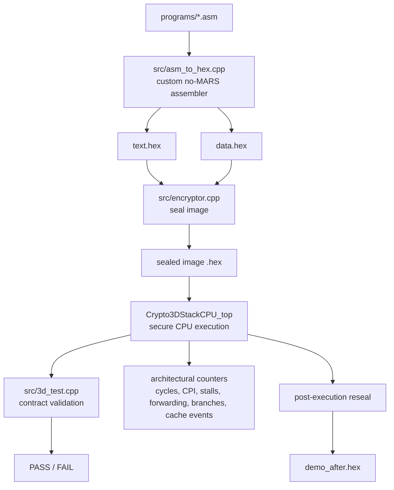
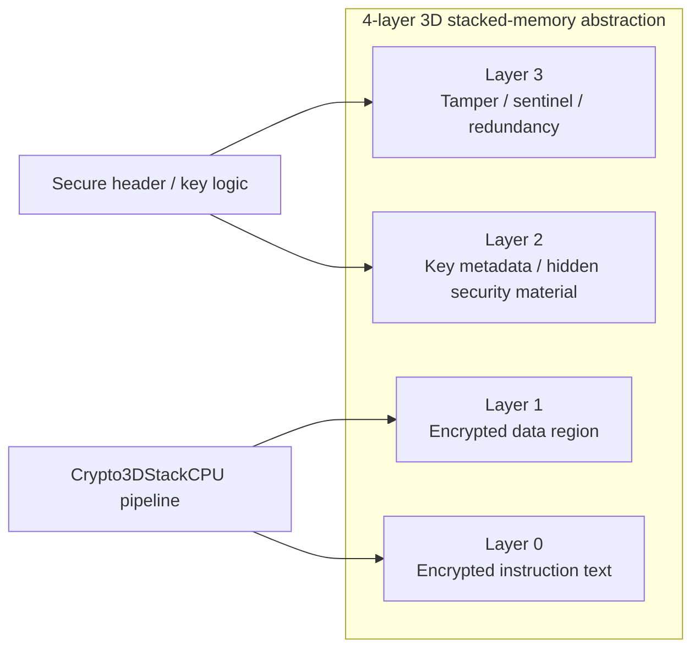
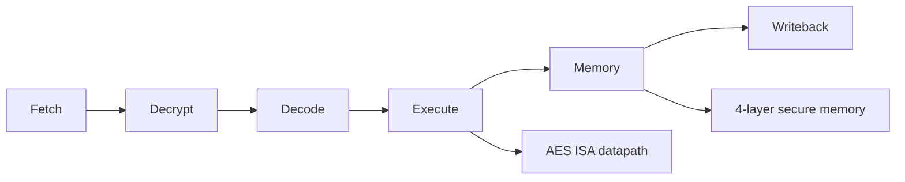
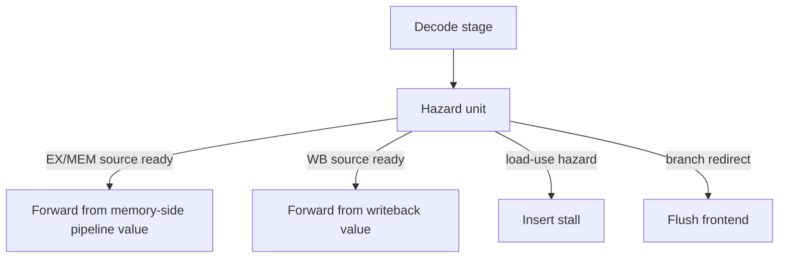

# Crypto3DStackCPU

**Crypto3DStackCPU** is a validated cryptographic CPU research prototype with an integrated **4-layer 3D-stacked-memory abstraction**, encrypted/authenticated sealed program images, executable AES ISA extensions, pipeline hazard handling, forwarding, basic branch prediction/recovery, architectural performance counters, and authenticated tamper rejection.

The repository is organized as a software/HLS-ready research prototype. It does **not** claim fabricated 3D silicon, FPGA timing closure, board validation, side-channel security, or production-grade security. Those are explicitly listed as future work.

---

## Project Metadata

| Field | Value |
|---|---|
| Project | Crypto3DStackCPU |
| Author | George David Tsitlauri |
| Affiliation | Department of Informatics & Telecommunications, University of Thessaly, Greece |
| Year | 2026 |
| Main language | C++17, PowerShell, MIPS-like assembly, SystemVerilog RTL stubs |
| Target direction | Vitis HLS / Vivado / Artix-7 AC701 (xc7a200tfbg676-2) validation |
| Current status | Software/HLS-ready prototype; full regression passed after folder reorganization |

---

## Current Claim, Non-Claims, and Scope

### What can be claimed

Crypto3DStackCPU currently provides:

- a MIPS-like in-order cryptographic CPU model;
- an integrated 4-layer 3D-stacked-memory abstraction;
- encrypted-at-rest instruction and data regions;
- authenticated sealed images with header validation and tamper rejection;
- executable `aesenc` and `aesdec` ISA extensions;
- forwarding, load-use stall handling, store-data forwarding, and branch recovery;
- architectural performance counters over a fixed validation window;
- a reproducible full regression suite with benchmarks and negative tests;
- an RTL-level 3D memory / TSV hardware-readiness package in `hardware_3d/`.

### What must **not** be claimed yet

Do **not** claim:

- FPGA-proven;
- Vivado timing-closed;
- validated on physical Artix-7 board;
- side-channel secure;
- impossible to reverse engineer;
- production-grade secure processor;
- fabricated real 3D-stacked-memory silicon.

Correct wording:

> Crypto3DStackCPU is a validated software/HLS-ready cryptographic CPU prototype with an integrated 4-layer 3D-stacked-memory abstraction and an RTL-level 3D memory/TSV hardware-readiness package.

---

## Repository Structure

After final organization, the repository is structured as follows:

```text
Crypto3DStackCPU/
├── src/
│   ├── 3d.cpp
│   ├── 3d.h
│   ├── 3d_test.cpp
│   ├── asm_to_hex.cpp
│   ├── encryptor.cpp
│   ├── decryptor.cpp
│   ├── crypto_kat_test.cpp
│   ├── multilayer_memory_test.cpp
│   └── header.h
├── programs/
│   ├── demo.asm
│   ├── demo.contract
│   ├── demo_alt.asm
│   ├── demo_alt.contract
│   ├── pipeline_hazard.asm
│   ├── pipeline_hazard.contract
│   ├── memory_stress.asm
│   ├── memory_stress.contract
│   ├── branch_stress.asm
│   ├── branch_stress.contract
│   ├── aes_stress.asm
│   └── aes_stress.contract
├── docs/
│   ├── ARCHITECTURE_COVERAGE.md
│   └── SECURITY_VALIDATION_NOTES.md
├── results/
│   └── README.md
├── paper/
│   └── crypto3dstackcpu_paper.tex
├── hardware_3d/
│   ├── rtl/
│   ├── tb/
│   ├── constraints/
│   ├── docs/
│   ├── fabrication/
│   ├── paper_appendix/
│   ├── scripts/
│   ├── stack_config.json
│   └── tsv_layer_map.csv
├── 3D_hls_component/
│   ├── 3D_hls_config.cfg
│   └── vitis-comp.json
├── run_all_tests.ps1
├── run_pipeline.ps1
├── run_security_audit.ps1
├── run_architecture_benchmarks.ps1
├── run_assembler_negative_tests.ps1
├── run_extended_tamper_tests.ps1
├── run_multilayer_memory_test.ps1
├── README.md
├── LICENSE
└── .gitignore
```

---

## High-Level System View



ASCII version:

```text
.asm program
    |
    v
custom assembler  ---> text.hex + data.hex
    |
    v
secure image sealer
    |
    v
authenticated encrypted image
    |
    v
Crypto3DStackCPU_top
    |
    +--> contract validation
    +--> performance counters
    +--> post-execution reseal
    +--> tamper rejection tests
```

---

## 4-Layer 3D-Stacked-Memory Organization

The final design uses four logical layers in the memory abstraction. The goal is not merely larger memory capacity, but **security separation**.

| Layer | Name | Role |
|---:|---|---|
| 0 | Text / instruction layer | Encrypted `.text`, secure fetch, block decrypt path |
| 1 | Data layer | Encrypted `.data`, secure `lw` / `sw` path |
| 2 | Key / metadata layer | Key metadata, wrapped-key material, hidden/security metadata abstraction |
| 3 | Tamper / sentinel layer | Tamper points, sentinels, redundancy/security markers |



ASCII stack:

```text
+--------------------------------------------------+
| Layer 3: tamper sentinels / redundancy metadata  |
+--------------------------------------------------+
| Layer 2: key metadata / hidden security material |
+--------------------------------------------------+
| Layer 1: encrypted data region (.data)           |
+--------------------------------------------------+
| Layer 0: encrypted instruction region (.text)    |
+--------------------------------------------------+
```

Why four layers instead of one?

- One layer works functionally, but all security objects are mixed together.
- Two layers separate code and data but still mix keys and tamper metadata.
- Three layers separate security metadata but mix key material and tamper sentinels.
- Four layers cleanly separate **code**, **data**, **key/security metadata**, and **tamper detection**.

Thus four layers are the best balance between architectural clarity and manageable complexity.

---

## Secure Image Layout

The sealed image uses a 32-word secure header followed by encrypted text and data regions. The default image size is 1024 32-bit words.

```text
word 0                                           word 1023
+----------------+----------------+----------------+--------+
| secure header  | encrypted text | encrypted data |  pad   |
| words 0..31    | .text blocks   | .data blocks   | zeros  |
+----------------+----------------+----------------+--------+
```

Important header fields are defined in `src/header.h`.

| Header words | Field | Meaning |
|---:|---|---|
| 0 | `MAGIC` | Secure image magic value |
| 1 | `VERSION` | Secure header version |
| 2 | `FLAGS` | Enabled secure features |
| 3 | `POLICY` | Tamper/reseal/map policy |
| 4--6 | text descriptor | text start, word count, end |
| 7 | epoch | reseal/mapping epoch |
| 8--11 | nonce | 128-bit nonce |
| 12--15 | wrapped key | AES-wrapped app key |
| 16--19 | key tag | truncated HMAC key tag |
| 20--23 | image tag | truncated HMAC image tag |
| 24--27 | measurement | image measurement digest fragment |
| 28--31 | data descriptor | data start, count, end, flags |

---

## Cryptographic Construction

### App key and session key

Each image receives a fresh 128-bit app key:

```math
K_{app} \in \{0,1\}^{128}
```

The app key encrypts executable text, data, and AES ISA operations. A session key is derived from a hardware-rooted secret, nonce, region descriptors, epoch, and measurement:

```math
K_s = \\mathrm{HKDF}(H_{root},\; N \parallel M,\; \text{info})
```

The app key is wrapped as:

```math
W = \\mathrm{AES}_{K_s}(K_{app})
```

### Image authentication

The sealed image is validated before instruction fetch. A simplified form of the tags is:

```math
T_K = \\mathrm{HMAC}_{K_s}(\texttt{KEYT} \parallel H_{fixed} \parallel W \parallel M)
```

```math
T_I = \\mathrm{HMAC}_{K_s}(\texttt{IMGT} \parallel H_{fixed} \parallel M \parallel C_{covered})
```

where:

- `H_fixed` is the fixed part of the secure header;
- `M` is the measurement digest;
- `C_covered` is the covered encrypted image content.

### Text block permutation

Instruction text is block encrypted and mapped through an epoch/nonce-driven permutation. For block index `b`:

```math
\pi(b) = ((m \cdot b + a) \bmod L) + start
```

where `gcd(m, L) = 1`, so the mapping is invertible.

---

## Secure Sealing Algorithm

```text
Algorithm SealImage(text.hex, data.hex)
1. Generate fresh per-image app key K_app.
2. Create secure header placeholder.
3. Define text and data regions.
4. Generate nonce and epoch-dependent mapping.
5. Encrypt text blocks with AES-K_app.
6. Encrypt data blocks with AES-K_app.
7. Measure fixed header and covered encrypted content.
8. Derive session key K_s with HKDF.
9. Wrap K_app under K_s.
10. Scatter/check hidden key metadata through the layer abstraction.
11. Compute key tag and image tag.
12. Emit sealed image.
```

---

## Secure Validation Algorithm

```text
Algorithm ValidateImage(image)
1. Read secure header.
2. Check magic, version, policy, region bounds, and flags.
3. Rebuild nonce/epoch mapping.
4. Recompute measurement.
5. Re-derive session key.
6. Verify wrapped-key consistency.
7. Verify key tag.
8. Verify full image tag.
9. If all checks pass, unwrap app key.
10. Unlock secure fetch/decrypt pipeline.
11. Otherwise, lock the CPU and refuse execution.
```

---

## CPU Pipeline

The CPU is an in-order MIPS-like pipeline with a dedicated decrypt stage.



ASCII pipeline:

```text
+-------+   +---------+   +--------+   +---------+   +--------+   +-----------+
| Fetch |-->| Decrypt |-->| Decode |-->| Execute |-->| Memory |-->| Writeback |
+-------+   +---------+   +--------+   +---------+   +--------+   +-----------+
```

The decrypt stage is central to the security model. Instructions are not decoded directly from the sealed image. The CPU first validates the image, unwraps the app key, maps the logical text block to a physical encrypted block, and decrypts the instruction block.

---

## Control Unit and Micro-Operations

The CPU uses hardwired pipelined control, not a microprogrammed controller. The following table summarizes representative micro-operations.

| Instruction | Fetch | Decrypt | Decode | Execute | Memory | Writeback |
|---|---|---|---|---|---|---|
| `add rd,rs,rt` | fetch block | AES decrypt | read `rs`,`rt` | ALU add | none | write `rd` |
| `sub rd,rs,rt` | fetch block | AES decrypt | read `rs`,`rt` | ALU sub | none | write `rd` |
| `addi rt,rs,imm` | fetch block | AES decrypt | read `rs` | ALU add imm | none | write `rt` |
| `lw rt,off(rs)` | fetch block | AES decrypt | read `rs` | address calc | secure data read | write `rt` |
| `sw rt,off(rs)` | fetch block | AES decrypt | read `rs`,`rt` | address calc | secure data write | none |
| `beq rs,rt,label` | fetch block | AES decrypt | read `rs`,`rt` | compare/redirect | flush if needed | none |
| `j label` | fetch block | AES decrypt | decode target | redirect | flush if needed | none |
| `aesenc rd,rs,rt` | fetch block | AES decrypt | read operands | AES encrypt | none | write `rd` |
| `aesdec rd` | fetch block | AES decrypt | read AES state | AES decrypt | none | write `rd` |

---

## Hazards, Forwarding, Stalls, and Branch Recovery

The CPU implements practical in-order hazard control:

- EX/MEM forwarding;
- WB forwarding;
- load-use stall detection;
- store-data forwarding;
- frontend recovery on branch/jump redirect;
- basic static branch prediction/recovery counters.



Load-use example:

```asm
lw   $2, 0($9)
add  $3, $2, $2   # must wait until loaded value is available
```

Store-data forwarding example:

```asm
add  $2, $3, $4
sw   $2, 0($9)    # store data forwarded instead of stale register value
```

The hazard benchmark `programs/pipeline_hazard.asm` specifically validates:

- forwarding from recent ALU results;
- forwarding from later pipeline stages;
- load-use stall behavior;
- store-data forwarding;
- correct final signature and register contract.

---

## Branch Prediction / Recovery

The branch mechanism is intentionally simple and deterministic. The frontend proceeds with a static prediction model and recovers by flushing the frontend when the Execute stage resolves a different next block.

```text
if predicted_next_block != resolved_next_block:
    flush fetch/decrypt/decode pipeline registers
    restart fetch at resolved_next_block
    increment branch_mispredict counter
else:
    continue normally
```

This is not a commercial dynamic predictor. It is a basic educational/research predictor/recovery mechanism suitable for a deterministic secure CPU prototype.

---

## Supported ISA

The ISA is a MIPS-like RISC subset with custom AES operations.

| Class | Instructions |
|---|---|
| Arithmetic | `add`, `sub`, `addi`, `mult` |
| Logic | `and`, `or`, `xor`, `ori`, `lui` |
| Shift | `sll`, `srl` |
| Memory | `lw`, `sw`, `la` pseudo-op |
| Control | `beq`, `bne`, `j` |
| Crypto | `aesenc`, `aesdec` |

The `aesenc`/`aesdec` operations are executable CPU instructions, not external tool operations.

---

## Memory Hierarchy

Crypto3DStackCPU uses a security-oriented hierarchy rather than a conventional desktop L1/L2/L3 hierarchy.

```text
Level 0: pipeline registers and AES co-processor state
Level 1: instruction/data cache counters and secure access buffers
Level 2: 4-layer 3D-stacked-memory abstraction
Level 3: sealed host image file
```

The important distinction is that text and data do not exist in plaintext outside the validated CPU execution boundary.

---

## Performance Counters

The testbench reports architectural counters over a fixed validation window of 2000 simulation cycles.

Counters include:

| Counter | Meaning |
|---|---|
| `cycles` | fixed validation simulation window |
| `retired` | retired instructions encoded in top status |
| `CPI` | cycles / retired over validation window |
| `stalls` | total stall events |
| `load_use_stalls` | stalls caused by load-use hazards |
| `forward_mem` | memory-side forwarding events |
| `forward_wb` | writeback forwarding events |
| `store_data_forwards` | store data forwarding events |
| `branch_predictions` | branch/frontend prediction events |
| `branch_mispredicts` | recovery/flush events |
| `aes_instructions` | executed AES ISA operations |
| `icache_hits/misses` | instruction-cache visibility counters |
| `dcache_hits/misses` | data-cache visibility counters |

Important note:

> CPI values are fixed-window architectural visibility metrics, not final optimized post-synthesis or FPGA board performance numbers.

---

## Final Regression Result After Reorganization

The final full regression run after the `src/`, `programs/`, and `docs/` reorganization completed successfully.

Final marker:

```text
[ALL REGRESSION TESTS PASSED]
Crypto KATs, multi-layer memory tests, assembler negative tests, demo audits, alt audits,
pipeline hazard/forwarding audit, architecture benchmark suite, and extended tamper rejection tests all passed.
```

Validated categories:

| Category | Result |
|---|---|
| AES-128 FIPS-197 KAT | PASS |
| 4-layer memory abstraction | PASS |
| Assembler negative tests | PASS |
| `programs/demo.asm` secure execution | PASS |
| `programs/demo_alt.asm` secure execution | PASS |
| Pipeline hazard / forwarding audit | PASS |
| Architecture benchmark suite | PASS |
| `memory_stress` | PASS |
| `branch_stress` | PASS |
| `aes_stress` | PASS |
| Extended tamper rejection | PASS |

Example counters from representative runs:

| Program | Retired | Stalls | Load-use | Forward MEM | Forward WB | Branch mispredicts | AES inst. | Signature |
|---|---:|---:|---:|---:|---:|---:|---:|---:|
| `demo.asm` | 60 | 1 | 1 | 17 | 10 | 2 | 2 | `0xAE` |
| `demo_alt.asm` | 11 | 0 | 0 | 3 | 1 | 0 | 0 | `0x2A` |
| `pipeline_hazard.asm` | 14 | 2 | 2 | 5 | 5 | 0 | 0 | `0x36` |
| `memory_stress.asm` | 14 | 0 | 0 | 4 | 4 | 0 | 0 | `0x0A` |
| `branch_stress.asm` | 7 | 0 | 0 | 4 | 1 | 2 | 0 | `0x0D` |
| `aes_stress.asm` | 11 | 0 | 0 | 3 | 3 | 0 | 4 | `0x0A` |

---

## How to Run

From the repository root:

```powershell
powershell -ExecutionPolicy Bypass -File .\run_all_tests.ps1
```

To save a timestamped log into `results/`:

```powershell
New-Item -ItemType Directory -Force .\results | Out-Null
$ts = Get-Date -Format "yyyyMMdd_HHmmss"
$log = ".\results\run_all_tests_$ts.log"
powershell -ExecutionPolicy Bypass -File .\run_all_tests.ps1 *>&1 | Tee-Object -FilePath $log
```

Expected final marker:

```text
[ALL REGRESSION TESTS PASSED]
```

---

## Manual Build Flow

The scripts already handle paths after the final reorganization. The logical flow is:

```powershell
# Build assembler
g++ -std=c++17 -O2 src/asm_to_hex.cpp -o asm_to_hex.exe

# Assemble program
./asm_to_hex.exe programs/demo.asm text.hex data.hex

# Build tools
g++ -std=c++17 -O2 src/3d.cpp src/encryptor.cpp -o encryptor_single.exe
g++ -std=c++17 -O2 src/3d.cpp src/decryptor.cpp -o decryptor_single.exe
g++ -std=c++17 -O2 src/3d.cpp src/3d_test.cpp -o 3d_test_single.exe

# Seal and run
./encryptor_single.exe text.hex data.hex demo.hex
./3d_test_single.exe demo.hex programs/demo.contract
```

---

## Vitis HLS Notes

The HLS configuration uses the reorganized paths:

```text
syn.file=../src/3d.cpp
tb.file=../src/3d_test.cpp
csim.argv=../demo.hex
```

Generate `demo.hex` before running CSIM. Vitis/Vivado/Artix-7 validation remains the next hardware step.

Target board: **Xilinx/AMD AC701 Artix-7 Evaluation Kit (EK-A7-AC701-G, xc7a200tfbg676-2)**. The AC701 supplies a 200 MHz LVDS reference on `SYSCLK_P/N`, which a Clocking Wizard inside the block design divides down to the 100 MHz CPU core clock consumed by `Crypto3DStackCPU_top`. See `hardware_3d/constraints/fpga_placeholder_constraints.xdc` for the AC701 pin mapping and `3D_hls_component/3D_hls_config.cfg` for the matching HLS target.

---

## Relation to Computer Engineering Courses

The project integrates material from four course areas.

| Course area | Concepts used in Crypto3DStackCPU |
|---|---|
| Principles of Computer Operation | MIPS assembly, registers, instruction operands, integer arithmetic, memory operands |
| Computer Organization | datapath, hardwired control, pipeline stages, hazards, forwarding, branch recovery, memory system |
| Computer Architecture | performance counters, CPI, benchmarks, branch behavior, memory hierarchy, Amdahl-style discussion |
| Parallel Systems / Hardware Description | layered memory organization, TSV abstraction, SystemVerilog model, future NoC/multicore path |

Not included by design:

- out-of-order execution;
- Tomasulo scheduling;
- superscalar issue;
- VLIW instruction format;
- cache coherence;
- OpenMP/MPI;
- GPU/SIMD programming.

These are listed as future work because they would substantially change the CPU model and security assumptions.

---

## Future Work

| Area | Future work |
|---|---|
| HLS/FPGA | Vitis HLS synthesis, Vivado integration, Artix-7 board validation |
| Timing/resource reports | LUT/FF/BRAM/DSP usage, Fmax, latency |
| Security | side-channel hardened AES, fault injection testing, TVLA-style leakage evaluation |
| Memory | deeper 3D stack model, ECC layer, remapping layer, decoy layer |
| Architecture | optional dynamic branch predictor, scoreboard, multicore/NoC extension |
| Fabrication | ASIC-ready RTL, PDK access, GDSII, DRC/LVS, TSV planning, foundry collaboration |

---

## Cleanup

Generated artifacts can be removed safely:

```powershell
Remove-Item -Force *.exe, *.hex, text.hex, data.hex, decrypted_text.hex, demo_after.hex, postrun.contract, demo_tamper.hex, tamper_*.hex -ErrorAction SilentlyContinue
Remove-Item -Force .\multilayer_memory_test -ErrorAction SilentlyContinue
```

Do not remove:

```text
src/
programs/
docs/
paper/
results/
hardware_3d/
3D_hls_component/
README.md
LICENSE
.gitignore
run_*.ps1
```

---

## Final Status

Crypto3DStackCPU is complete at the software/research/HLS-ready prototype level. The next step is Vitis/Vivado synthesis and Artix-7 hardware validation.

